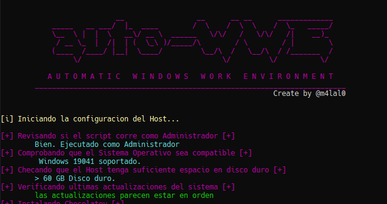
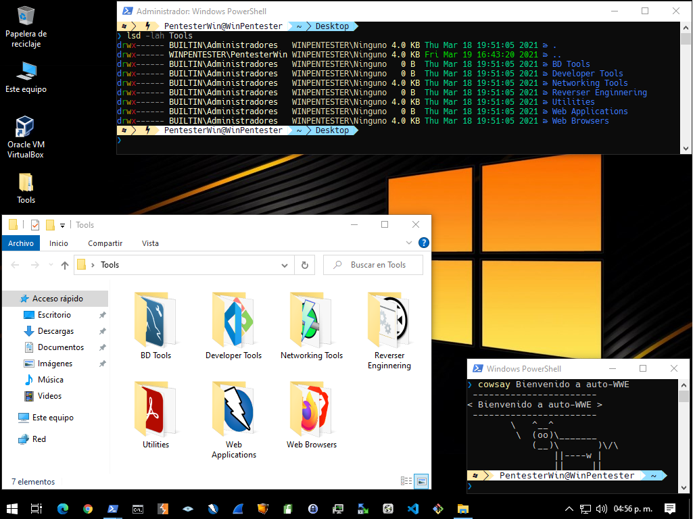

# auto-WWE

[](#)
[](#)
[](#)
[](#)

```
                    __                 __      __ __      _____________
     _____   __ ___/  |_  ____        /  \    /  \  \    /  \_   _____/
     \__  \ |  |  \   __\/ __ \  ______   \/\/   /   \/\/   /|    __)_ 
      / __ \_  |  /|  | (  \_\ )/_____/\        / \        / |        \
     (____  /____/ |__|  \____/         \__/\  /   \__/\  / /_______  /
          \/                                 \/         \/          \/ 

     A U T O M A T I C   W I N D O W S   W O R K   E N V I R O N M E N T
     ___________________________________________________________________
                                                              By @m4lal0
```
Script hecho en Powershell que instala diferentes herramientas y configura un entorno de trabajo en Windows para el Pentesting o desarrollo.

## Instalación

#### Requerimientos mínimos

+ Windows 10 1803, 1809, 1903, 1909, or 2004
+ 60 GB Hard Drive
+ 2 GB RAM

#### Recomendado

+ Windows 10 2004
+ 100+ GB Disco Duro
+ 4+ GB RAM
+ 2 adaptadores de red

### Instrucciones

1. Abrir Powershell como Administrador.
2. Dentro de Powershell ubicarse en el directorio donde va a querer descargar el script
3. Descarga el script con el comando: ```iwr -Uri 'https://raw.githubusercontent.com/m4lal0/auto-WWE/main/install.ps1' -OutFile 'install.ps1'```
4. Habilitar la ejecución del script con el comando: ```Set-ExecutionPolicy -Scope CurrentUser Unrestricted -f```
5. Desbloquee el archivo de configuración con el comando: ```Unblock-File .\install.ps1```
6. Finalmente, ejecute el instalador: ```.\install.ps1```



## Herramientas instaladas



#### BD Tools
- MySQL
- MySQL Workbench
- PostgreSQL
- SQLite DB Browser
- SQL Server Management Studio

#### Developer Tools
- Git
- Go
- Java
- Python 2
- Python 3
- Visual Studio Code

#### Networking Tools
- Advanced-IP-Scanner
- AngryIP
- Fing
- MobaXTerm
- Netcat
- Nmap
- OpenVPN
- Putty
- SSLScan
- Telnet
- VNC Viewer
- Windows Terminal
- WinSCP
- Wireshark

#### Reverse Enginnering
- Cutter
- Dependency Walker
- FLOSS
- Ghidra
- PE Explorer
- Resource Hacker
- x64dbg

#### Utilities
- 7-Zip
- Adobe Reader
- AdwCleaner
- Autopsy
- AxCrypt
- Bitwarden
- BleachBit
- CurrPorts
- Crystal Disk Info
- Etcher
- ExifTool
- FOCA
- GIMP
- Gobuster
- HashCat
- HashTools
- HTTP File Server (hfs)
- HTTrack
- HxD
- Java 8
- Keepass
- NordVPN
- OpenStego
- PeaZip
- Process Hacker
- Process Monitor
- Regshot
- Rufus
- ScreenToGif
- SimpleDNSCrypt
- Thunderbird
- VirtualBox
- Volattility
- VLC

#### Web Applications
- Burp Suite
- OWASP Zap

#### Web Browsers
- Bave
- Firefox
- Google Chrome
- Microsoft Edge
- TOR Browser

#### Custom Powershell
- bat command
- duf command
- file command
- FZF command
- grep command
- lsd command
- Oh-my-posh

> y muchas más herramientas...